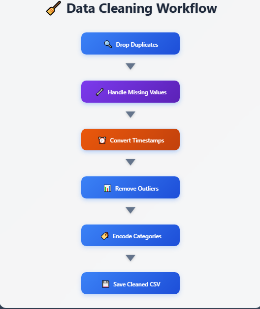

# 🧹 NYC Taxi Data Cleaning for Machine Learning

This repository demonstrates a complete, reproducible workflow for cleaning real-world taxi trip data using Python. The goal is to transform raw, messy data into a machine learning–ready format by applying best practices in preprocessing, outlier handling, and feature engineering.

---

## 📌 Project Overview

The dataset used is the **2017 NYC Yellow Taxi Trip Records**, which contains millions of rows of trip-level data including timestamps, passenger counts, distances, and fare breakdowns.

This project focuses on:

- Identifying and removing duplicates
- Handling missing and invalid values
- Converting and validating timestamp formats
- Removing outliers in fare, distance, and duration
- Encoding categorical variables
- Saving a clean, structured CSV for downstream ML tasks

---

## 🧠 Why Data Cleaning Matters

Before any model can be trained, the data must be trustworthy. This repo showcases how to:

- Build reproducible cleaning pipelines
- Document each transformation step
- Prepare datasets for regression, classification, or clustering
- Communicate your process clearly to clients or collaborators

---

## 🧪 Technologies Used

- Python 3.10+
- pandas
- numpy
- matplotlib & seaborn (for optional visual insights)
- Google Colab (for notebook-based exploration)

---

## 📁 Repository Structure

```plaintext
nyc-taxi-data-cleaning/
│
├── data/
│   ├── raw/                  # Original dataset (optional sample)
│   └── cleaned/              # Final cleaned CSV file
│
├── notebooks/
│   └── nyc_taxi_cleaning.ipynb   # Annotated Colab notebook
│
├── scripts/
│   └── clean_data.py         # Modular Python script version
│
├── visuals/
│   ├── workflow-preview.png      # Screenshot of HTML workflow
│   └── data-cleaning-workflow.html  # Animated HTML flowchart
│
├── requirements.txt





🙋‍♀️ About Me
I'm Amna Bibi, a freelance data scientist and automation specialist focused on reproducible ML workflows, dashboard deployment, and Python-based automation. I help clients turn messy data into actionable insights—ethically and efficiently.


